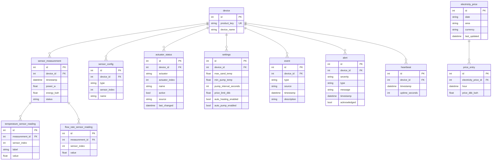

```mermaid
erDiagram
    device {
        int id PK
        string product_key UK
        string device_name
    }

    sensor_measurement {
        int id PK
        int device_id FK
        datetime timestamp
        float power_w
        float energy_kwh
        string status
    }

    temperature_sensor_reading {
        int id PK
        int measurement_id FK
        int sensor_index
        string label
        float value
    }

    flow_rate_sensor_reading {
        int id PK
        int measurement_id FK
        int sensor_index
        float value
    }

    sensor_config {
        int id PK
        int device_id FK
        string type
        int sensor_index
        string name
    }

    actuator_status {
        int id PK
        int device_id FK
        string actuator
        int actuator_index
        string name
        bool active
        string source
        datetime last_changed
    }

    settings {
        int id PK
        int device_id FK
        float max_sand_temp
        float min_pump_temp
        int pump_interval_seconds
        float price_limit_dkk
        bool auto_heating_enabled
        bool auto_pump_enabled
    }

    event {
        int id PK
        int device_id FK
        string type
        string source
        datetime timestamp
        string description
    }

    alert {
        int id PK
        int device_id FK
        string severity
        string type
        string message
        datetime timestamp
        bool acknowledged
    }

    heartbeat {
        int id PK
        int device_id FK
        datetime timestamp
        int uptime_seconds
    }

    electricity_price {
        int id PK
        string date
        string area
        string currency
        datetime last_updated
    }

    price_entry {
        int id PK
        int electricity_price_id FK
        datetime hour
        float price_dkk_kwh
    }

    device ||--o{ sensor_measurement : ""
    device ||--o{ sensor_config : ""
    device ||--o{ actuator_status : ""
    device ||--o{ settings : ""
    device ||--o{ event : ""
    device ||--o{ alert : ""
    device ||--o{ heartbeat : ""
    sensor_measurement ||--o{ temperature_sensor_reading : ""
    sensor_measurement ||--o{ flow_rate_sensor_reading : ""
    electricity_price ||--o{ price_entry : ""
```
